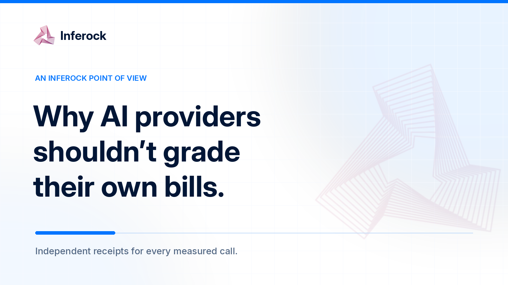
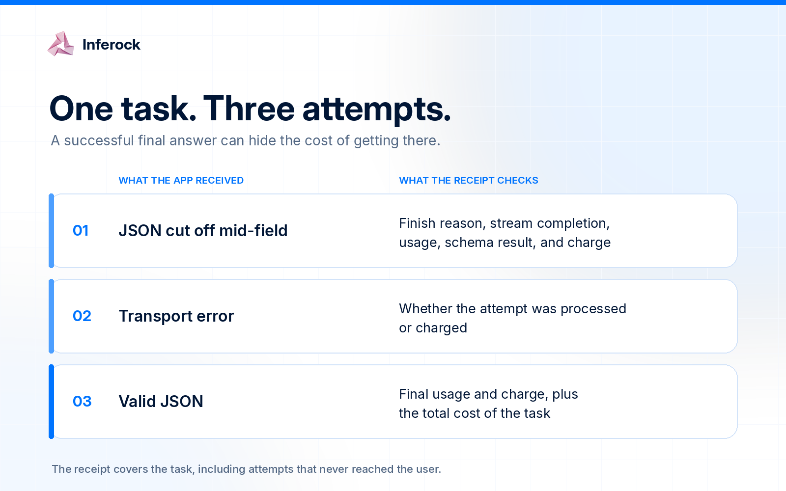

# Why AI Providers Shouldn’t Grade Their Own Bills

*And why the future of AI routing is an independent layer that credits back what providers break.*

Let’s look at a bill that looks completely normal.

Your app asks a model to return a JSON object. The model starts well enough, gets halfway through a field, and stops. Your parser rejects the response. Your app retries. The second attempt works, the user never sees the first one, and the dashboard records two API calls. Somewhere in the usage column, the broken attempt sits quietly beside the useful one.

There may be no billing error here. Tokens were processed and generated. The meter counted them. But you paid for a response your software could not use, then paid again to finish the job.

That distinction is the point. A provider can bill correctly under its terms while delivering a failed result for your application. We need to account for both facts. Right now, **the industry counts tokens precisely and broken work rather poorly.**

## The bill knows what ran. Your product cares what arrived.

Compute has always charged for resources rather than outcomes. An EC2 instance bills while it is running, even if your application on it crashes or sits idle. That bargain is clear: you rent the machine; you own the code. [AWS describes the charge in terms of the instance’s running state](https://docs.aws.amazon.com/AWSEC2/latest/UserGuide/ec2-instance-lifecycle.html).

With a model API, you control much less of the execution path. The provider decides how to run the model, when to stop it, what usage to report, and how to price that usage. You buy input and output tokens. Your app needs an answer that meets its contract. Those are different units.

If you ask for prose, a cut off paragraph may be mildly annoying. If you ask for a tool call with a required `account_id`, a response ending after `"account_` is a failed transaction. The tokens on the invoice are real. So is the failure.

The cause matters. Did the model hit an output limit you set? Did the provider end the stream? Did your client stop reading? Each calls for a different remedy, but a month-end invoice cannot tell you which happened. Engineering sees retries, finance sees spend, and support sees a user error. Those should be three views of the same event, tied to its charge.

## The company holding the meter also writes the rules

We don’t think provider billing teams are sitting around plotting how to collect forty cents from your malformed JSON. That would be a terrible use of a calendar invite.

The structural issue is simpler. The provider runs the service, reports usage, publishes the billing rules, and often holds the most detailed account of what happened inside its system. You get an API response, your own logs if you kept them, and an invoice later. When those records disagree, the provider’s record tends to be the starting point for the conversation.

Even when everyone acts in good faith, customers need their own receipt: what was requested, what arrived, and what was charged.

To be fair, providers do expose useful signals. OpenAI’s response events can include an `incomplete` status, an incomplete reason, and token usage details. Google’s Gemini API exposes separate usage metadata for candidate, thinking, and cached tokens. These are valuable fields, and they make independent checking possible in some cases. They do not, by themselves, tell you whether your application received a usable answer or whether a given failure qualifies for a refund. [OpenAI’s streaming reference](https://platform.openai.com/docs/api-reference/responses-streaming/response/refusal) and [Google’s token documentation](https://ai.google.dev/gemini-api/docs/generate-content/tokens) show how much nuance is already present in the raw records.

We want customers to have a second ledger. It should preserve the provider’s usage report and check it against delivery, completion, pricing, and the contract the app expected. When the evidence cannot establish a billing discrepancy, it should say so. A modest, verifiable finding beats a dramatic refund estimate made from guesswork.

There is an important distinction here. **A billing error** means the charge conflicts with measurable usage, a rate, a discount, or a published rule. **A service failure** means the call did not produce the result your application needed. A single event can be both. It can also be only one of them. The accounting should keep those possibilities separate.

## What actually gets lost between the request and the invoice

The failure modes are mundane, which makes them easy to bury in ordinary traffic.

**An empty response with billed usage.** We call this signal `BILLED_EMPTY`. Zero visible characters alone does not prove the meter is wrong: models may use billed reasoning tokens, return a tool call, or represent a refusal separately. The question is whether the call delivered anything usable under the agreed contract after those token classes and output types are accounted for.

**A truncated response.** The model returns most of a JSON object, then stops before the closing braces. If your output cap was too low, fix your configuration. If the upstream stream ended unexpectedly, investigate the route. Either way, the receipt needs the finish reason, bytes delivered, usage, and schema result to show what the failed call cost.

**A retry cascade.** An agent hits an error, retries, times out, retries again, and finally succeeds. The customer sees one task; the provider may see several attempts. We would not claim every error is billed. We do want to know which attempts were processed and charged, and what the *whole task* cost. The successful final call is a flattering but incomplete number.

**A token or cache mismatch.** Visible text is not always the full token count; hidden reasoning and other token classes can appear in usage. A suspected cache hit is not a confirmed discount, either. Compare the provider’s usage categories, applicable model rates, and observed charge before calling anything an overcharge. Sometimes the result is a strong billing candidate. Sometimes it is a question for review.

Here is a small example. It is illustrative, not a claim about any provider’s production billing:

Record only attempt 3 and you see success. Record the whole task and you see what success cost.

OpenRouter has already shown that a clearer remedy is possible for one narrow category: it [announced zero charge for responses with zero completion tokens under its stated conditions](https://openrouter.ai/blog/announcements/never-pay-for-empty-ai-responses-again/). That is a useful precedent. It also illustrates why the details matter. Zero completion tokens is a specific rule; it does not automatically cover every partial stream, invalid schema, retry, or answer a customer cannot use.

If you have seen a failure mode we missed, bring it to [inferock-bench on GitHub](https://github.com/inferock/inferock-bench). The measurement rules are public, and issues help us make the receipts more accurate.

## Why the receipt belongs in the routing path

Many teams send traffic through multiple providers, frameworks, and fallback routes. Then finance asks why inference spend rose and gets four dashboards with four definitions of “request.” A routing layer gives selected traffic one accountable path and records the call while it happens.

You cannot reconstruct a broken stream from a month-end invoice. You need the requested output, upstream route, bytes delivered, finish state, usage, and retries. A receipt created in the request path keeps those facts together and connects multiple attempts to the task that caused them.

That is the idea behind Inferock. You send selected inference traffic through one accountable path; the path keeps route, timing, response, usage, and charge evidence attached to each observed call. It can report objective failures such as empty or malformed output when the evidence supports them, and it can keep weaker findings in a separate review category. The [methodology](https://inferock.ai/methodology/) describes the measurements and their limits.

There are two ways to use that accountability. The difference matters.

With **Bring Your Own Keys**, you keep your provider accounts and pay those provider bills directly. Inferock measures traffic and gives you receipts and loss reporting. If the evidence points to a provider billing issue, you have a better record to investigate or dispute it. Inferock does not promise to refund charges on a bill it does not control.

With **Managed inference**, Inferock operates the upstream provider relationship for approved traffic. That creates room for a service credit when an eligible, objective failure meets the agreed terms. The credit is bounded and capped. It is not a blanket promise that every bad answer will turn into free tokens. The [current pricing and mode description](https://inferock.ai/pricing/) makes that distinction explicit.

The rule starts with evidence. Did the call pass through the measured path? Is there a priced usage or charge record? What failed, and was the cause upstream, client-side, or a configuration limit? Does it meet the service terms? The receipt should show the answer and any gap in the evidence.

## Put the remedy where the failed call happened

We have seen enough software bills to know that a support dispute over a few cents is rarely worth an engineer’s afternoon. A finance team might recover a large invoice error, but it will not open a ticket for every broken completion. So the small failures get written off. The product team absorbs the retries, the customer absorbs the wait, and the provider’s invoice remains the only neat document in the room.

The remedy has to be built into the workflow if it is going to work at the size of an individual API call.

For eligible Managed traffic, the mechanism is straightforward in principle. The receipt identifies an objective failure. It ties that failure to an observed, priced call. The agreed service terms decide whether it qualifies. A bounded service credit is then applied to the customer’s Inferock account for future inference. The customer can see the event, the evidence, the amount, and the status. No one needs to compose a support essay about a fifteen-cent response.

We are deliberately saying **service credit**, because it matters who is making the promise. A credit from Inferock in Managed mode is our remedy to our customer under our terms. It is not evidence that the upstream provider admitted an invoice error or sent us a refund. When the provider itself charged the wrong amount, that is a separate billing-integrity question, and the receipt should help pursue it. Conflating the two would recreate the very opacity we are trying to remove.

Consider a made-up team that spends $10,000 on model calls in a month. Say its receipts show $120 of objectively failed, priced Managed calls that meet its agreed credit terms. The report can show those calls and the bounded credit due under the agreement. It should not inflate the number with slow requests that missed a user’s patience threshold, suspected cache discounts without charge proof, or refusals that may have been correct. Those may deserve attention. They do not belong in the same dollar total.

This separation also helps engineering. If the same route produces repeated truncation, the right response may be a larger output cap, a different model, a stricter response format, or failover. A credit gives the customer a fair financial outcome for a qualifying failure. A receipt gives the team a way to reduce the next one. Both are useful; neither substitutes for the other.

And yes, routing can help before a credit is ever needed. If a provider is unavailable, a healthy fallback can rescue the user task. But that does not erase the failed attempt. We want the record to show both: the user eventually got an answer, and the route needed two attempts to deliver it. Reliability metrics that count only the final answer hide the cost of getting there.

## A new standard for accountable inference

There is a tempting version of this argument where every ugly model response is called an overcharge and every provider is cast as a villain. It would make for a loud post. It would also make it harder for anyone serious to build a fair system around the problem.

Here is the standard we are willing to defend.

Every material model call should have a customer-readable receipt. That receipt should connect the request, upstream route, delivered response, completion state, usage, applicable rate, observed charge, and any retry to one logical operation. It should say what can be verified and what cannot. It should separate a provider-recognized billing error from a service failure measured by an independent standard. When a company sells managed inference with a credit promise, the qualifying failure should produce a visible, bounded remedy without a support scavenger hunt.

We also want teams to stop accepting “the API returned 200” as proof that the job was done. A valid HTTP status is useful. A valid result for your customer is the thing you actually needed. The gap between them has a cost, and that cost should be measurable.

We’re building Inferock around that conviction. You should be able to point to a call and say: this is what we asked for, this is what arrived, this is what the meter recorded, this is what failed, and this is what happens next. If the evidence is incomplete, we should say that in the same place. If a Managed failure qualifies for a credit, the credit should be visible there too.

Providers will keep improving their meters. They should. We want them to publish clearer rules for partial streams, failed calls, hidden token classes, and cache charges. Their own credit policies should become easier to understand and use. But the only record of a failed purchase should not come from the company that sold it.

That is the standard we want to see across AI infrastructure: **a bill you can check, a failure you can prove, and a remedy whose limits are clear before you need it.**

If you want to see this on your own traffic, [request an Inferock invite](https://inferock.ai/#waitlist).

If your model spend is growing, you already have enough uncertainty in the system. Your invoice should not be another one.
